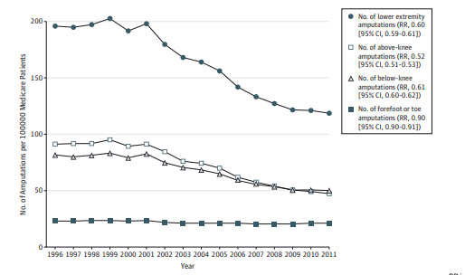

# Trends in Toe and Foot Amputations with US Medicare Beneficiaries 

## Project Overview 

This project uses toe and foot amputation data from CMS's inpatient and outpatient data.
The goal of this project is to understand the trends in utilization of inpatient and outpatient toe and foot amputation services. The chart below shows general trends in amputation. As you can see, there appears to be a slight decrease in toe and foot amputations from 23 to 21 percent. I wanted to extend this previous chart for only the toe and foot amputations until 2016? and make predictions for the next 10 years for toe and foot amputations. I want to know if there was an change in the rate post 2011 as well. 

## The Resources/Tools
        

## The Process

### Step 1 Data Wrangling 

To begin, individual datasets were downloaded from the hcupnet website. 
This is what I selected. Create New Analysis Table >> Inpatient/Descriptive Stats >> Choose Year >> Specific Diagnosis/Precoedre-Yes >> Proocedure Code Selection - Code 10

Once the individual datasets were downloaded, I checked the variable types in **SAS 9.4**.
Then, I created a macro to merge all the datasets together. Rename variables if needed for the initial merge. 

### Step 2 Data Cleaning 
 I checked for invalid character values and missing data. Then, I looked for out of range data. 
 I checked for invalid numeric values and missing data. I checked to see if any data types need to be converted. Last, I checked the range for variables. I looked for duplicates and values that are repeating. I checked that dates are correctly formatted. Relabel variables as needed. I dropped any unimportant variables. 

#### Learned my data. 
Mean/Medium/Mode and n for variables of interest 
Histograms.... 

### Step 3 Modeling 

## Results 

These results could help guide planning for toe and foot amputation services.

### References 

https://hcupnet.ahrq.gov/#setup

Goodney PP, Tarulli M, Faerber AE, Schanzer A, Zwolak RM. Fifteen-Year Trends in Lower Limb Amputation, Revascularization, and Preventive Measures Among Medicare Patients. JAMA Surg. 2015;150(1):84–86. doi:10.1001/jamasurg.2014.1007

